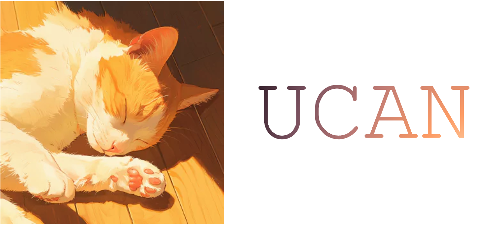

<p align="center">
  <h1 align="center">
 <br>
 UCAN: Unified Convolutional Attention Network  <br>  for Expansive Receptive Fields in Lightweight Super-Resolution</h1>
  <p align="center">
    Cao Thien Tan<sup>1,2,3</sup>
    ·
    Phan Thi Thu Trang <sup>3,5</sup>
    ·
    Do Nghiem Duc</a><sup>6</sup>
    ·
    Ho Ngoc Anh</a><sup>5</sup>
    ·
    Hanyang Zhuang</a><sup>4</sup>
    . <br>
    Nguyen Duc Dung</a><sup>2</sup>
  </p>
  <p align="center">
    <sup>1</sup>Ho Chi Minh City Open University &nbsp; &nbsp;   <sup>2</sup>AI Tech Lab, Ho Chi Minh City University of Technology  <br>
    <sup>3</sup>Code Mely AI Research Team &nbsp; &nbsp; <sup>4</sup>Global College, Shanghai Jiao Tong University <br> 
    <sup>5</sup>Ha Noi University of Science and Technology &nbsp; &nbsp;  <sup>6</sup>University of Manitoba   
  </p>
  <h3 align="center">
  CVPR 2026 - Poster
  </h3>
  <h3 align="center"><a href="https://arxiv.org/abs/2603.11680">[Paper]</a></h3>
</p>


---

> **Abstract:** *Hybrid CNN-Transformer architectures achieve strong results in image super-resolution, but scaling attention windows or convolution kernels significantly increases computational cost, limiting deployment on resource-constrained devices. We present UCAN, a lightweight network that unifies convolution and attention to expand the effective receptive field efficiently. UCAN combines window-based spatial attention with a Hedgehog Attention mechanism to model both local texture and long-range dependencies, and introduces a distillation-based large-kernel module to preserve high-frequency structure without heavy computation. In addition, we employ cross-layer parameter sharing to further reduce complexity. On Manga109 (4×), UCAN-L achieves 31.63 dB PSNR with only 48.4G MACs, surpassing recent lightweight models. On BSDS100, UCAN attains 27.79 dB, outperforming methods with significantly larger models. Extensive experiments show that UCAN achieves a superior trade-off between accuracy, efficiency, and scalability, making it well-suited for practical high-resolution image restoration.* 

Repo updating...
## 🔥 News
- 2026-02: 🎉UCAN is accepted by CVPR 2026! This repo is released.

## 🛠️ Setup

- Python 3.10+
- PyTorch 2.0+ + Torchvision 0.15+
- NVIDIA GPU + [CUDA](https://developer.nvidia.com/cuda-downloads)

```bash
git clone https://github.com/hokiyoshi/UCAN.git
conda create -n UCAN python=3.10
conda activate UCAN
pip install -r requirements.txt
python setup.py develop
```

## 🗃️ Datasets

Training and testing sets can be downloaded as follows:

| Training Set                                                 |                         Testing Set                          |                        Visual Results                        |            Log             |             Weight             |
| :-----------------------------------------------------------: | :----------------------------------------------------------: | :----------------------------------------------------------: | :----------------------------------------------------------: |:----------------------------------------------------------: |
| [DIV2K](https://data.vision.ee.ethz.ch/cvl/DIV2K/) (800 training images, 100 validation images) [organized training dataset DIV2K: [One Drive](https://1drv.ms/u/c/de821e161e64ce08/Eb1dyRMuCJBGjmtUUJd1j2EBbDhcSyHBYqUeqKjhuPb49Q?e=3RMxbs)] | Set5 + Set14 + BSD100 + Urban100 + Manga109 [complete testing dataset: [One Drive](https://1drv.ms/u/c/de821e161e64ce08/EUN4kTCUdBtNuvJnb2Jy3BkByBMErLIqpiQI4NG6HcAXWQ?e=3k5dGK)] | Updating | [x2](https://drive.google.com/file/d/1kFA8Tffv-7ZJIPclKoW0ATOEOUIpLF-q/view?usp=sharing)[x3](https://drive.google.com/file/d/1XbM5qYDg-C7hrvMlOGNBTR4GR2-G_hO2/view?usp=drive_link)[x4](https://drive.google.com/file/d/1ZUqvh0W42PMpRTo294d1Y3oqTS2EUH27/view?usp=sharing) | [Link](https://github.com/hokiyoshi/UCAN/releases/tag/1.0) |


## 💡 Models

## 🚀 Training

```bash
python basicsr/train.py -opt options/Train/train_UCAN_x2.yml
```

## 🧪 Testing

Place pretrained weights under `experiments/pretrained_models/`, then run:

```bash
# x2
python basicsr/test.py -opt options/Test/test_UCAN_x2.yml
# x3
python basicsr/test.py -opt options/Test/test_UCAN_x3.yml
# x4
python basicsr/test.py -opt options/Test/test_UCAN_x4.yml
```

Results are saved to `results/`.

## 📚 Results

## 🙇 Citation

## 🥂 Acknowledgements
This work is based on [BasicSR](https://github.com/XPixelGroup/BasicSR), [HiT-SR](https://github.com/XiangZ-0/HiT-SR), [ESC](https://github.com/dslisleedh/ESC) and [MambaIRv2](https://github.com/csguoh/MambaIR). We thank them for their great work and for sharing the code.
